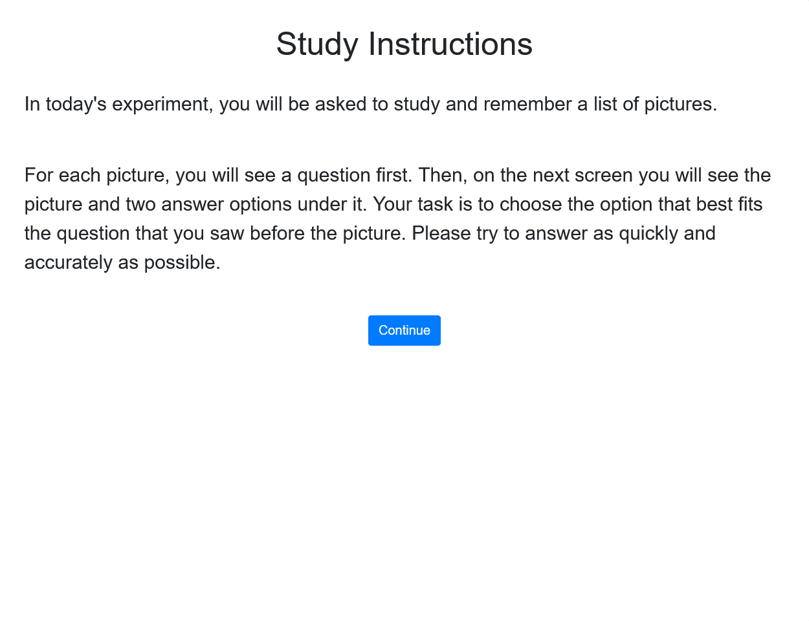
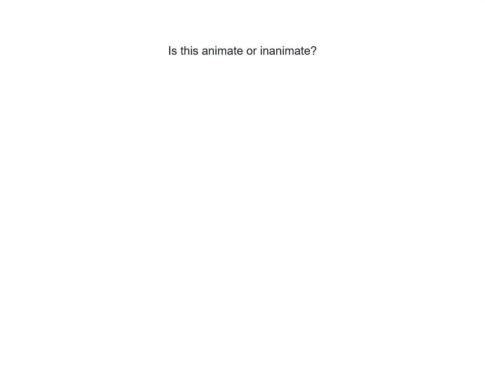

# starter task

Create an simple experiment based on https://github.com/PCLLAB/LoP-Effect.

Estimated time: many hours

kyle available for help and questions

please use all tools and resources available

## Initialize experiment

Basically copy the files and structure from `LoP-Effect/E1`.

- `Materials` holds things like images and json files containing instructions and question/answers. We will only be using the `Practice.json` and pictures in the `Practice` folder for this experiment to keep it short.
- `css` holds css. Mostly unused, but impossible to delete.
- `js` holds js libraries. You may notice an ancient version of jquery and bootstrap 🤮.
- `plugins` contains jsPsych plugins
- `experiment.html` is where everything starts. It uses all the js and css files and starts the experiment.
- `experiment.js` is where the logic is defined. This is 99% of what you will need to edit.
- `jspsych.js` is the star of the show. Important to notice, this is jspsych v5.
- `lab-start.html` and `verify.html` are used to manually set experiment conditions/parameters. You start at `lab-start.html` which directs to `verify.html` which directs to `experiment.html` with the chosen URL parameters.

`experiment.js` is the basically the only file you will need to edit.

## Running an experiment locally

Serve it however you want, it's just a website. If you have `npm`, you can run the following commands.

```sh
npx http-server -c-1
# `-c-1` disables caching, see https://github.com/http-party/http-server
```

Access the website via the link in your terminal. You will usually need to go to `/experiment.html` to see the experiment or `/lab-start.html` if the experiment requires certain parameters.

`LoP-Effect` has a parameter `Version` so the final url is something like `/experiment.html?Version=1`

## Experiment details

You should have all the same files as `LoP-Effect/E1` in your folder. You can delete everything in your `experiment.js` and add stuff one by one to see how it work.

Here is a stripped down example.

```js
const files = {
  arbitraryName: "path to JSON file",
};

class Experiment {
  constructor() {
    this.timeline = [];

    //calls this.loadMaterials()
  }

  loadMaterials() {
    // loads JSON files and makes them available as fields
    //
    // calls this.buildTimeline() and this.run()
  }

  buildTimeline() {
    const instructionTrial = {
      type: "pcllab-core",
      stimuli: [this.arbitraryName["field in json file"]],
      show_button: true,
      button_text: "Continue",
      response_count: 0,
      minimum_time: 7000,
    };

    this.timeline.push(instructionTrial);
  }

  run() {
    // start jsPsych with the built timeline
    //
    // once finished, sends a post request with experiment data to store in backend
    //
    // EACH EXPERIMENT HAS A UNIQUE URL TO POST DATA TO, CREATE ONE IN JARVIS
  }
}
```

You can strip out anything related to URL paramters, versions, conditons. There is just one version for this task.

There should be an instruction trial first.


Your experiment should use `"Materials/Practice.json"` instead of the `"Materials/Order1.json"` and do basically the same thing, show a question, followed by the image and two buttons to respond for each item.




After, the data should be sent to and visible in https://jarvis.psych.purdue.edu/

- Create a new "experiment" using the + icon and use the new data collection URL instead of the URL already in LoP-Effect
